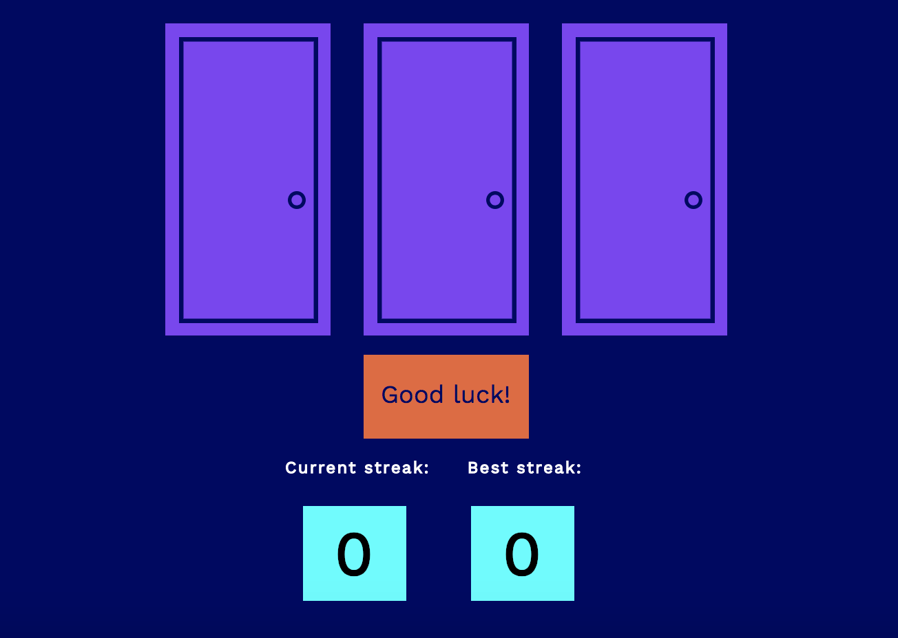

### Milestone Project: Avoid the ChoreBot! | Next Steps

Welcome to the the __Next Steps__ section of the Milestone Project! This is an extra opportunity to improve the view and functionality of your ChoreBot game!

Assessment: Creating Winning Streaks & High Scores

Wouldn't it be great to play this game with the opportunity to record consecutive victories and establish a high score for all challengers to beat? You can build this feature using __HTML__, __CSS__, and __JavaScript__! At the end of your efforts, your scores should look similar to this image:



Task: First in the __index.html__ page beneath the `<div class="start-row">`, add a `<table>` element with the class name `"score-row"` and nested inside this `<table>`, add a `<tr>` element. Inside this `<tr>` parent, add two `<th>` child elements. Both will have the class name `"score-text"`. Type 'Current streak:' in between the first `<th></th>` tags and 'Best streak:' in between the second `<th></th>` tags.

Hint: Make sure that your HTML elements are properly nested to make your code more readable:

```html
<table class="table-class">
  <tr>
    <th class="table-header-class">Visible Text</th>
    <th class="table-header-class">Visible Text</th>
  <tr>
</table>
```

Task: The `<th>` elements in their current state are very hard to see in the corner.  

Navigate to the __style.css__ file and add two CSS selectors - `score-row` and `score-text`.  The `score-row` selector is responsible for `text-align` and the `score-text` is responsible for the following:

  * margin-right - 17px
  * padding - 5px 
  * display - inline
  * letter-spacing - 1.1px
  * font-family 
  * font-size 
  * color 

See if you can determine the values for the last three properties!

Hint: Experiment, look at other selectors for clues, and have fun!

```css
.class { 
  property: value;
}
```

Task: The next task is to build the boxes that will hold the `score` and `highScore` values within the same `<table>`.  

In your new `<table>` beneath your original `<tr>` element, create another `<tr>` element. Inside this new `<tr>` parent element, add two `<th>` child elements. Both will have the class name `"score-box"`.

Task: Give this first `<th>` child element an `id` of `score-number` and give the second nested `<th>` child element an `id` of `high-score-number`.

Hint: You can add the `id` attribute inside the `<th>` tag:

```html
<tr>
  <th class="class-name" id="id-name"/> 
</tr>
```

Task: These boxes cannot be seen yet because have to create the CSS selector `score-box` within the __style.css__ file. This selector should have the following properties and values:

  * margin-top - 9px 
  * display - inline-block
  * padding - 8px
  * margin - 18px
  * margin-right - 29px
  * width - 59px
  * background-color
  * font-family
  * font-size

See if you can determine the last three properties.

Hint: A class selector's property and value are assigned with:

```css
.class { 
  property: value;
}
```

Task: This takes care of the __HTML__ and __CSS__ components of the scores. Now it's time to tackle the __JavaScript__ logic! 

Within your `script.js` file, add two global variables - `score` and `highScore` and set their values to `0`. Then add two more global variables - `currentStreak` and `bestStreak`. The `currentStreak` variable should accept the `id` value of `"score-number"` and the `bestStreak` variable should accept the `id` value of `"high-score-number"`. 

Hint:

Hint: Use the DOM method: 

```js
let object = document.getElementById('id');
```

Task: Finally, at the bottom of your global variable list, set `currentStreak.innerHTML` to `score` and set `bestStreak.innerHTML` to `highScore`.

Hint: Use the DOM method: 

```js
object.innerHTML = 'New text'
```

Task: Now add the logic `GameOver()` function.

Underneath the line that changes the `startButton.innerHTML`, write a `getYourScore()` function (which has not been written yet).

Hint: 

```js
startButton.innerHTML = 'You win! Play again?';
getYourScore();
```

Task: Create a new `function` under your `gameOver()` function called `getYourScore()`. Within this function, write the logic that increases the `score` variable by `1` every time this function is called.

Hint:

```js
score++;
```

Task: Great - now all you need is to have this `score` displayed and updated as you play the game! 

Under your `score` increase logic, change the `innerHTML` of the `currentStreak` variable to `score`.

Hint

```js
variable.innerHTML = otherVariable;
```

Play a round and watch your current streak increase with each victory!

Task: With your first victory, you should also see your best streak increase with your current streak. Let's work on establishing your `highScore`!

Write an `if` statement that checks if your `score` is greater than your `highScore`. If it does, the `highScore` should be assigned to the value of `score`.

Hint: The `if-else` statement should follow this logic:

```js
if (variableA > variableB) {
  variableB = variableA;
}
```

Task: Inside this `if` statement, change the `innerHTML` of the `bestStreak` variable to `highScore`.

Hint:

```js
variable.innerHTML = otherVariable;
```

Refresh the page and play a few rounds and watch as your `bestStreak` increases with each victory!

Task: Notice how the current `score` doesn't reset back to `0` even if you lose. Inside the `gameOver()` function, within the `else` statement, set the `score` back to `0` and then reset the `innerHTML` of the `currentStreak` back to `0`.

Hint:

```js
else {
  score = 0;
  currentStreak.innerHTML = score;
}
```

Assessment: Convert the randomChoreDoorGenerator to a Switch Statement

Task: The current logic within the `randomChoreDoorGenerator()` gets away with an `if-else` statement that has only 3 possible door combinations where the ChoreBot is hiding.  As a result, the variety suffers (ie. If the ChoreBot is assigned to `openDoor1`, then `openDoor2` is ALWAYS the beach and `openDoor3` is ALWAYS outer space).

Use a `switch` statement, instead, to generate all 6 possible door combinations. This will require tweaking the current `Math` function to produce `6` possible values for `choreDoor`.

Hint:

```js
switch(expression) {
  case 0:
    code block;
    break;
  case 1:
    code block;
    break;
  ...
```

Refresh the page and play through multiple rounds. Enjoy the sheer randomness through which the images appear!

Wow! Now you have a legitmate scoreboard that reflects your current winning streak and records your highest streak. You also have every possible combination of doors and the images that hide behind them. See if you can think of any other features from your favorite games that would integrate well with ChoreBot!

