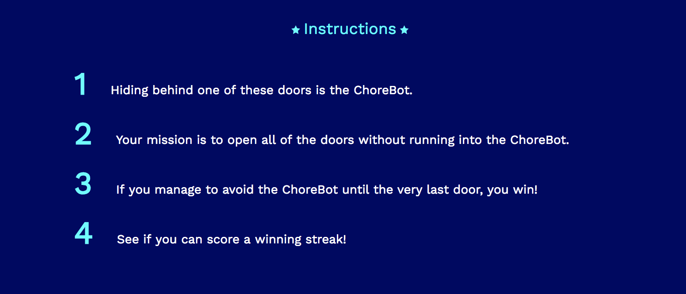
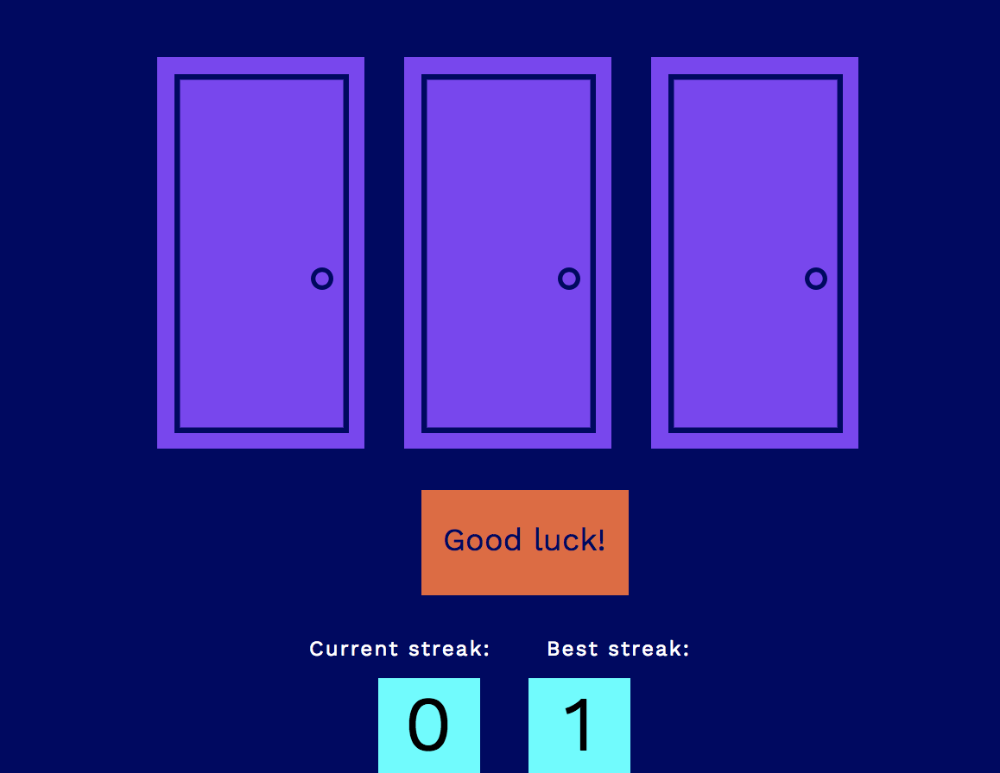

##Milestone Project: Avoid the ChoreBot!

###Bringing It All Together

Let's build a Milestone Project utilizing all the HTML, CSS, and JavaScript concepts covered in the previous modules of your **Web Development Path**! 

###Project Overview
Your mission is to construct a single-page website that plays a fully-functional game. You will see how **HTML**, **CSS**, and **JavaScript** interact harmoniously to produce a dynamic website and hopefully, you'll have fun along the way!

### Next Steps - HTML & CSS Styling

Welcome to the the **Next Steps** section of the Milestone Project! This is an extra opportunity to improve the view and functionality of your ChoreBot game! First, focus on making the numbers larger and brighter, like this picture illustrates:





1. [ ] Inside each `each-direction` `<div>` in your **index.html** page, create a new `<p>` element with the class name `'instructions-list'` and number them accordingly.
    
2. [ ] In the **style.css** file, create an `instructions-list` selector and add the following properties and values:
 
    ````
    display: inline;
    margin-top: 11px;
    margin-right: 23px;
    font-family: 'Work Sans';
    font-size: 36px;
    font-weight: 600;
    color: #00ffff;
    ````

### Next Steps - Creating Winning Streaks & High Scores

Wouldn't it be great to play this game with the opportunity to record consecutive victories and establish a high score for all challengers to beat? You can build that feature using **HTML**, **CSS**, and **JavaScript**! It should look similar to this image:



1. [ ] First in the **index.html** page beneath the `<div class="start-two">`, add a `<div>` element with the class name `"score-row"` and nested inside this new `<div>`, add two `<p>` elements with the class name `"score-text"`. Type `Current streak` in the first `<p>` element and `Best streak` in the second `<p>` element. 

    >Hint - Make sure that your HTML elements are properly nested to make your code more readable.
    
    ```
    <div class="parent">
    	<div class="child>
    		<p></p>
    	</div>
    </div>
    ```
		
2. [ ] The `<p>` elements in their current state are very hard to see in the corner.  Navigate to the **style.css** file and add two selectors - `score-row` and `score-text`.  The `score-row` selector is responsible for `text-align` and the `score-text` is responsible for `margin-right: 28px`, `letter-spacing: 1.1px`, `display`, `font-family`, `font-size`, and `color`. See if you can determine the values for the last four properties!

    >Hint - experiment, look at other selectors for clues, and have fun!
    
3. [ ] The next task is to build the boxes that will hold the `score` and `highScore` values.  Beneath the `score-row` `<div>`, add another `<div>` and set its class name to `score-row`. Inside this second `score-row` `<div>`, nest two more `<div>` elements with the class name `score-box`. Give this first nested `<div>` an `id` of `score-number` and give the second nested `<div>` an `id` of `high-score-number`.

	>Hint - You can add the `id` attribute inside the `` tag.

4. [ ] These boxes cannot be seen yet because the **style.css** needs the selector `score-box`. This selector is responsible for `margin-top: 9px`, `margin-right: 24px`, `display`, `width`, `height`, `background-color`, `font-family`, and `font-size`. See if you can determine the last six properties!

    Hint - experiment, look at other selectors for clues, and have fun!

5. [ ] This takes care of the **HTML** and **CSS** components of the scores. Now it's time to tackle the **JavaScript** logic! In the `<script></script>` tags, add two global variables - `score` and `highScore` and set their values to `0`. Then add two more global variables - `scoreDisplay` and `highScoreDisplay`. The `scoreDisplay` variable should accept the `id` value of `"score-number"` and the `highScoreDisplay` variable should accept the `id` value of `"high-score-number"`. Finally, at the bottom of your global variable list, set `scoreDisplay.innerHTML` to `score` and set `highScoreDisplay.innerHTML` to `highScore`.
 
    >Hint - Use the DOM method: `document.getElementById('id')`
     and `obj.innerHTML = 'New text'`

6. [ ] Now add the logic `winnerGameOver()` function to increase the `score` each time the function is called. Then set the `scoreDisplay.innerHTML` to reflect the updated score. 

    > Hint - `score++;`
    
7. [ ] Alright! The `score` is displayed but we need the `highScore` to reflect the best winning streak. Create a new function called `determineHighScore()` and write an `if-else` statement that will update the `highScore` if the current `score` is greater than the current `highScore` (which has the default value of `0`).

    >Hint - the `if-else` statement should follow this logic:
    
    ```
    if (valueA > valueB) {
    	valueB = valueA;
    	valueBDisplay.innerHTML = valueB;
    	}
       ```

8. [ ] Now you need to call the `determineHighScore()` every time the `winnerGameOver()` function is called. Place the `determineHighScore()` function at the bottom of the `winnerGameOver()` function.

9. [ ] Notice how the current `score` doesn't reset back to `0` even if you lose. Add logic to the `gameOver()` function to set the `score` back to `0` when the function is called and then adjust the `scoreDisplay.innerHTML` reflect the score's reset back to `0`.

	>Hint - `obj.innerHTML = 'New text'`
	
10. [ ] Excellent work! Now the only task left is to separate the **JavaScrip** from the **index.html** file. Transfer (via copy & paste) all the **JavaScript** logic between the `<script></script>` tags to a new file called `script.js`. Make sure not to include the actual `<script></script>` tags in this new file. Finally, to load this `script.js` file onto the **index.html** file, you need to add this line at the *bottom* of the `<body>` tag: `<script type="text/javascript" src="script.js"></script>`. 
	
Wow! Now you have a legitmate scoreboard that reflects your current winning streak and records your highest streak. See if you can think of any other features from your favorite games that would integrate well with ChoreBot!

```
Solution Code - HTML

  <head>
    <title>Chore Door!</title>
    <link href='./style.css' rel='stylesheet' type='text/css'>
    <link href="https://fonts.googleapis.com/css?family=Work+Sans" rel="stylesheet" type='text/css'>
  </head>

  <body>


    <div class="first-row">
      
      <p class="instructions-title">Instructions</p>
      
    </div>

    <div class="second-row">
      <div class="each-direction">
        <p class="instructions-list">1</p>
        <p class="instructions">Hiding behind one of these doors is the ChoreBot.</p>
      </div>
      <div class="each-direction">
        <p class="instructions-list">2</p>
        <p class="instructions">Your mission is to open all of the doors without running into the ChoreBot.</p>
      </div>
      <div class="each-direction">
        <p class="instructions-list">3</p>
        <p class="instructions">If you manage to avoid the ChoreBot until the very last door, you win!</p>
      </div>
      <div class="each-direction">
        <p class="instructions-list">4</p>
        <p class="instructions">See if you can score a winning streak!</p>
      </div>
    </div>

    <div class="door-row">
      
      
      
    </div>

    <div class="start-row" id="start">Good luck!</div>

    <div class="score-row">
      <p class="score-text">Current streak:</p>
      <p class="score-text">Best streak:</p>
    </div>

    <div class="score-row">
      <div class="score-box" id="score-number"></div>
      <div class="score-box" id="high-score-number"></div>
    </div>
    
  </body>
  <script></script>
</html>
```
```
Solution Code - CSS

body {
  background-color: #010165;
  margin: 0px;
}

.header {
  background-color: #00ffff;
  text-align: center;
}

.first-row {
  margin-top: 42px;
  text-align: center;
}

.instructions-title {
  display: inline;
  font-family: 'Work Sans';
  font-size: 18px;
  color: #00ffff;
}

.instructions-list {
  display: inline;
  margin-top: 11px;
  margin-right: 23px;
  font-family: 'Work Sans';
  font-size: 36px;
  font-weight: 600;
  color: #00ffff;
}

.second-row {
  position: absolute;
  margin-top: 17px;
  right: 25%;
}

.each-direction {
  margin-top: 15px;
}

.instructions {
  display: inline;
  font-family: 'Work Sans';
  font-size: 14px;
  color: #ffffff;
}

.door-row {
  margin-top: 305px;
  text-align: center;
}

.door-frame {
  cursor: pointer;
}

.start-row {
  margin: auto;
  width: 120px;
  height: 43px;
  background-color: #eb6536;
  padding-top: 18px;
  font-family: 'Work Sans';
  font-size: 18px;
  text-align: center;
  color: #010165;
  margin-bottom: 21px;
  cursor: pointer;
}

.score-row {
  text-align: center;
}

.score-text {
  margin-right: 28px;
  display: inline;
  font-family: 'Work Sans';
  font-size: 12px;
  letter-spacing: 1.1px;
  color: #ffffff;
}

.score-box {
  margin-top: 9px;
  display: inline-block;
  margin-right: 24px;
  width: 59px;
  height: 55px;
  background-color: #00ffff;
  font-family: 'Work Sans';
  font-size: 45px;
}

```

```
Solution Code - JavaScript

<script>
  let doorImage1 = document.getElementById('door1');
  let doorImage2 = document.getElementById('door2');
  let doorImage3 = document.getElementById('door3');
  let startButton = document.getElementById("start");
  let botDoor = "images/Robot_open_door.svg";
  let beachDoor = "images/beach_open_door.svg";
  let spaceDoor = "images/space_open_door.svg";
  let closedDoor = "images/closed_door.svg";
  let doors = 3;
  let openDoor1;
  let openDoor2;
  let openDoor3;
  let door1Doom;
  let door2Doom;
  let door3Doom;
  let door1Clicked = false;
  let door2Clicked = false;
  let door3Clicked = false;
  let currentlyPlaying = false;
  let score = 0;
  let highScore = 0;
  let scoreDisplay = document.getElementById('score-number');
  let highScoreDisplay = document.getElementById('high-score-number');
  scoreDisplay.innerHTML = score;
  highScoreDisplay.innerHTML = highScore;

  startButton.onclick = () => {
    if (!currentlyPlaying) {
      startRound();
    }
  }

  const startRound = () => {
    currentlyPlaying = true;
    door1Clicked = false;
    door2Clicked = false;
    door3Clicked = false;
    door1Doom = false;
    door2Doom = false;
    door3Doom = false;
    doors = 3;
    doorImage1.src = closedDoor;
    doorImage2.src = closedDoor;
    doorImage3.src = closedDoor;
    startButton.innerHTML = 'Good luck!';
    randomChoreDoorGenerator();
  }

  const randomChoreDoorGenerator = () => {
    choreDoor = Math.floor(Math.random() * doors);
    if (choreDoor === 0) {
      door1Doom = true;
      openDoor1 = botDoor;
      openDoor2 = beachDoor;
      openDoor3 = spaceDoor;
    } else if (choreDoor === 1) {
      door2Doom = true;
      openDoor2 = botDoor;
      openDoor1 = beachDoor;
      openDoor3 = spaceDoor;
    } else {
      door3Doom = true;
      openDoor3 = botDoor;
      openDoor1 = beachDoor;
      openDoor2 = spaceDoor;
    }
  }

  doorImage1.onclick = () => {
    if (!door1Clicked) {
      door1Clicked = true;
      doorImage1.src = openDoor1;
      doors--;
      if (doors===0) {
        winnerGameOver();
      } else if (door1Doom) {
        gameOver();
      }
    }
  }

  doorImage2.onclick = () => {
    if (!door2Clicked) {
     door2Clicked = true;
     doorImage2.src = openDoor2;
      doors--;
      if (doors===0) {
        winnerGameOver();
      } else if (door2Doom) {
        gameOver();
      }
    }
  }

  doorImage3.onclick = () => {
    if (!door3Clicked) {
      door3Clicked = true;
      doorImage3.src = openDoor3;
      doors--;
      if (doors===0) {
        winnerGameOver();
      } else if (door3Doom) {
        gameOver();
      }
    }
  }

  const gameOver = () => {
    score = 0;
    scoreDisplay.innerHTML = score;
    startButton.innerHTML = 'Game Over! Play again?';
    door1Clicked = true;
    door2Clicked = true;
    door3Clicked = true;
    currentlyPlaying = false;
  }

  const winnerGameOver = () => {
    score++;
    scoreDisplay.innerHTML = score;
    startButton.innerHTML = 'You win! Play again?';
    currentlyPlaying = false;
    determineHighScore();
  }

  const determineHighScore = () => {
    if (score > highScore) {
      highScore = score;
      highScoreDisplay.innerHTML = highScore;
    }
  }

  startRound();

</script>

